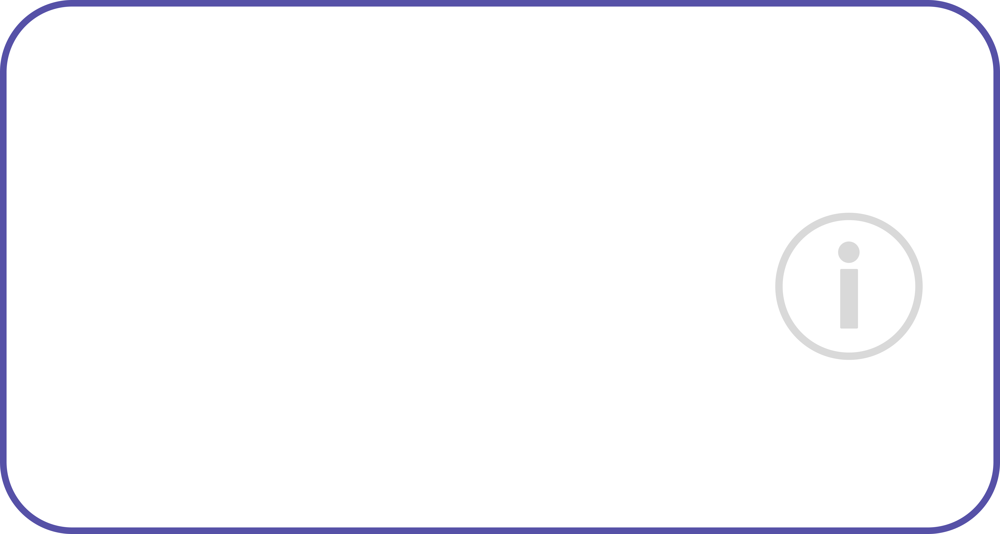

# SpeakHub
SpeakHub is a powerful Discord bot built with discord.py that lets users create their own voice channels by joining a "Join to Create" channel. You can fully customize your channel, adjusting settings, permissions, and more. Enjoy complete control and personalization for a unique voice chat experience!
-

-

